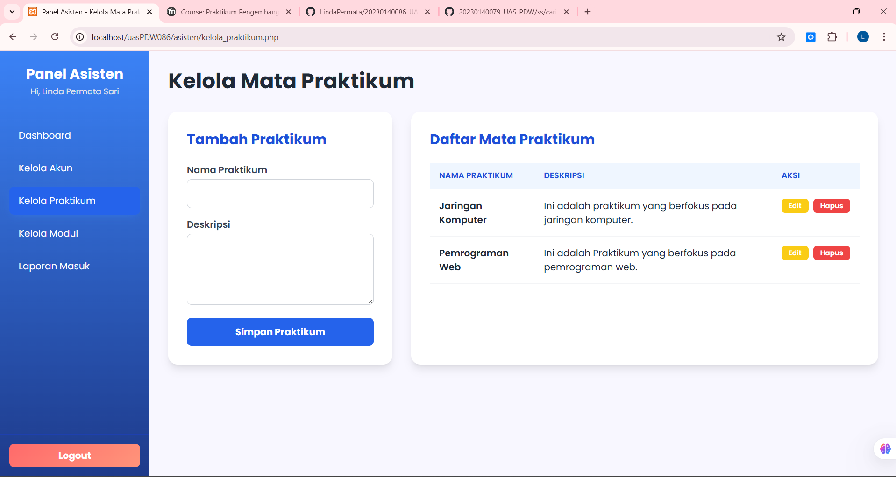
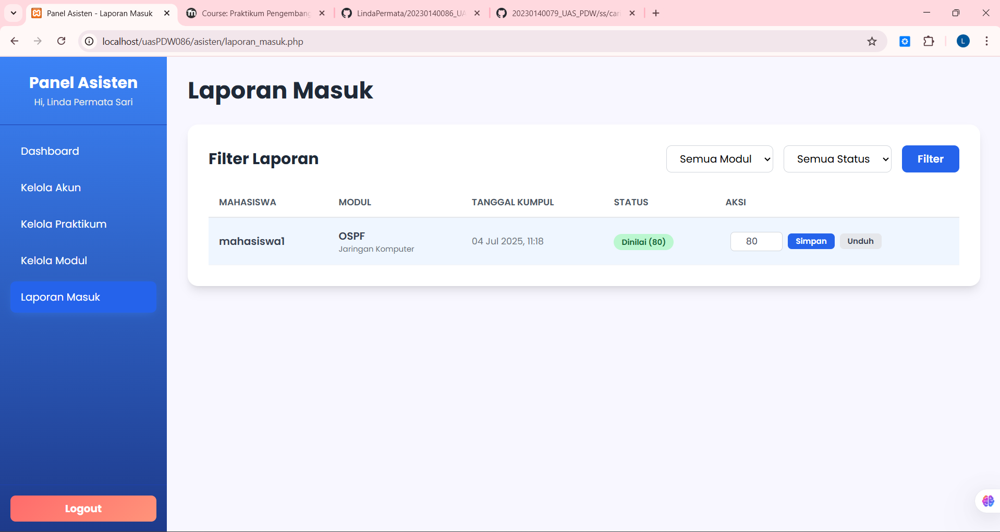
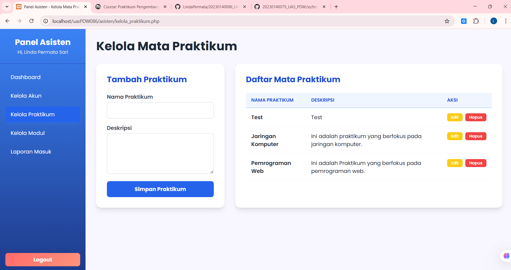
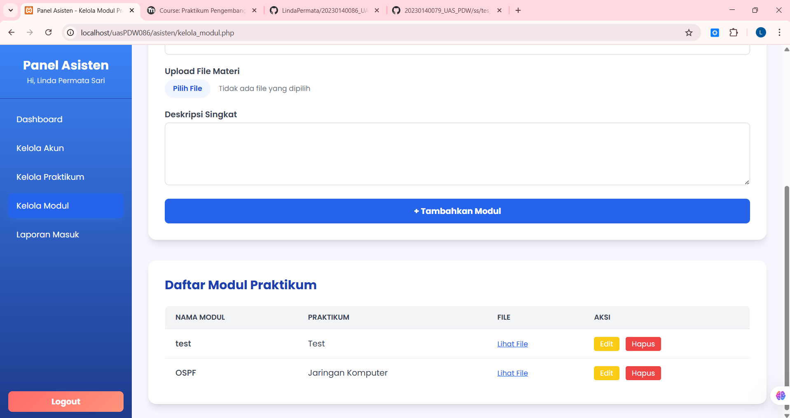
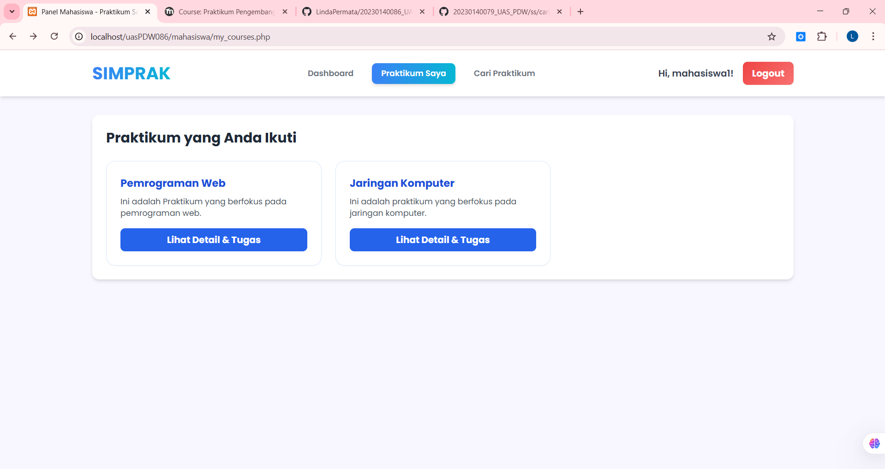
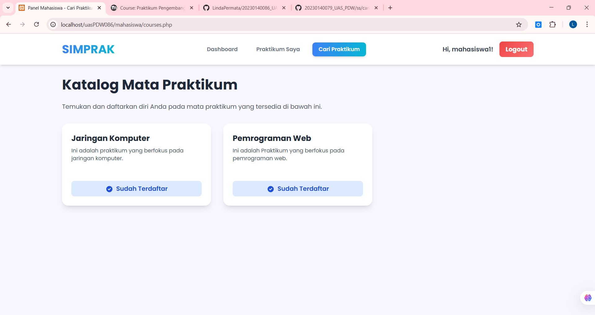
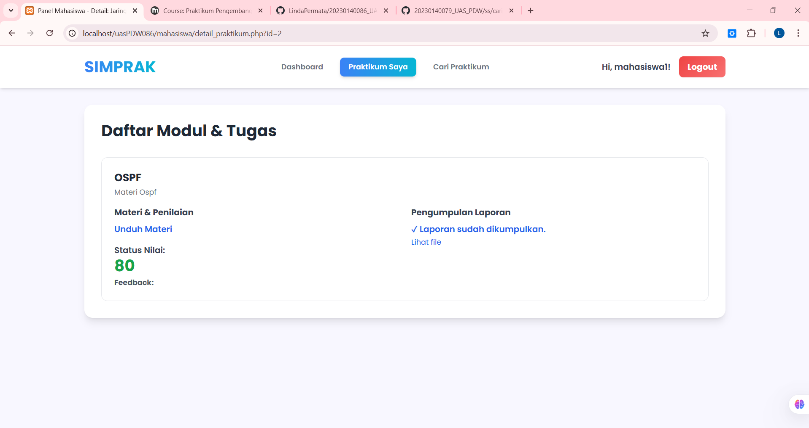

# SIMPRAK - Sistem Informasi Manajemen Praktikum

SIMPRAK adalah sistem informasi berbasis web yang digunakan untuk mengelola proses praktikum, mulai dari registrasi pengguna, login, pengelolaan modul, praktikum, hingga penilaian tugas. Sistem ini dibangun dengan tujuan mempermudah interaksi antara mahasiswa dan asisten praktikum secara digital.

---

## 🖼️ Tampilan Aplikasi (Alur Lengkap)

### 1️⃣ Registrasi

### 2️⃣ Login

### 3️⃣ Dashboard Asisten

### 4️⃣ Kelola Modul

### 5️⃣ Kelola Praktikum

### 6️⃣ Laporan Masuk

---

## 🔁 Pengujian Fitur CRUD

### 🔧 Test CRUD - Kelola Akun

### 🔧 Test CRUD - Kelola Praktikum

### 🔧 Test CRUD - Modul

---

## 🎓 Tampilan Mahasiswa

### 📌 Dashboard Mahasiswa

### 🔍 Lihat Detail Tugas

### 📝 Pendaftaran Praktikum

### 📊 Nilai Tugas

